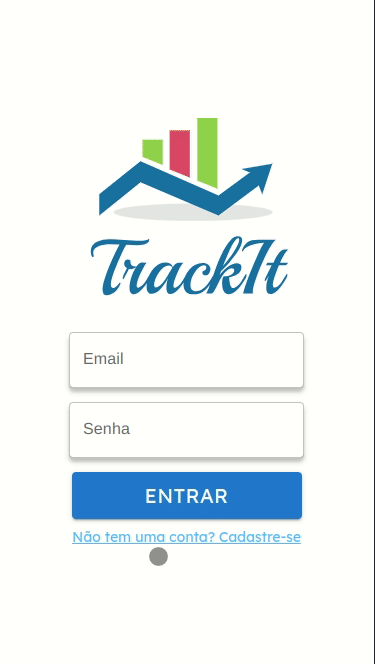

# Projeto TrackIt 📈

Aplicação de acompanhamento de Hábitos. Com este app, você pode criar e acompanhar seus hábitos diários, semanais e mensais. TrackIt permite registrar seus hábitos e monitorar seu progresso de forma rápida e fácil. 

Pensando na acessibilidade do usuário a aplicação conta com icones e progressos que visam facilitar a experiência do usuário, tanto para criar, como parar ver o progresso e mais ainda acompanhar seu histórico de hábitos.

📱 <a href="https://track-it-three-wine.vercel.app/"> Link para a Aplicação </a>
<p align="center">
  
</p>

## Sobre

O trackIt é uma aplicação em que o usuário pode monitorar seus hábitos de maneira rápida e prática. E além disso pode verificar o seu histórico.

- Login
- Cadastro
- Hábitos
- Hoje
- Histórico
- Featuras Futuras : <br> - Logout <br> - Editar

  ## Tecnologias
  
    
    
  
  
  
   
    
  
    
  

  O React foi escolhido como tecnologia principal porque oferece diversos recursos e bibliotecas que facilitam o desenvolvimento de interfaces de usuário. E o MUI foi escolhido pois possui recursos para acessibilidade do usuário. E o Vercel foi a plataforma para o deploy do projeto.

## Como rodar

1. Clone este repository em https://github.com/taisoliva/track-it.git
2. Navegue até a pasta trackIt e abra no seu editor de código favorito. 
3. Instale as dependẽncias
```bash
npm i
```
4. Rode a aplicação com 
```bash
npm run start
```
5. Finalmente acesse http://localhost:3000 no seu browser favorito (exceto no Internet Explorer)

## API 
### Cadastro
  Para fazer cadastro, faça uma requisição POST para a URL 

  ```bash 
    https://mock-api.bootcamp.respondeai.com.br/api/v2/trackit/auth/sign-up
  ```
enviando um corpo no formato

```bash 
    {
	email: "...",
	name: "...",
	image: "...",
	password: "..."
}
```
### Login 

Para fazer Login, faça uma requisição `POST` para a URL

```
https://mock-api.bootcamp.respondeai.com.br/api/v2/trackit/auth/login
```

enviando um corpo no formato

```jsx
{
	email: "...",
	password: "..."
}
```
### Hábito 
Para criar um hábito, faça uma requisição `POST` para a URL

```
https://mock-api.bootcamp.respondeai.com.br/api/v2/trackit/habits
```

enviando um corpo no formato

```jsx
{
	name: "Nome do hábito",
	days: [1, 3, 5] // segunda, quarta e sexta
}
```

e um cabeçalho `Authorization` com formato `Bearer TOKEN`

O servidor responderá com um objeto no formato

Para listar os hábitos do usuário, faça uma requisição `GET` para a URL

```
https://mock-api.bootcamp.respondeai.com.br/api/v2/trackit/habits
```

com um cabeçalho `Authorization` com formato `Bearer TOKEN`

O servidor responderá com uma array no formato

Para excluir um hábito do usuário, faça uma requisição `DELETE` para a URL

```
https://mock-api.bootcamp.respondeai.com.br/api/v2/trackit/habits/ID_DO_HABITO
```

com um cabeçalho `Authorization` com formato `Bearer TOKEN`, subtituindo `ID_DO_HABITO` na URL pelo id do hábito a ser deletado.

Para fazer listar os hábitos do usuário, faça uma requisição `GET` para a URL

```
https://mock-api.bootcamp.respondeai.com.br/api/v2/trackit/habits/today
```

com um cabeçalho `Authorization` com formato `Bearer TOKEN`

O servidor responderá com um array no formato.

Para fazer listar os hábitos do usuário, faça uma requisição `POST` , com o body vazio, para a URL

```
https://mock-api.bootcamp.respondeai.com.br/api/v2/trackit/habits/ID_DO_HABITO/check
```

com um cabeçalho `Authorization` com formato `Bearer TOKEN`, substituindo `ID_DO_HABITO` na URL pelo id do hábito a ser marcado.

Se:

- O hábito já estiver marcado
- O hábito não for do dia atual
- O hábito não for do usuário logado

o servidor vai responder com `Bad Request (400)`.

Para fazer listar os hábitos do usuário, faça uma requisição `POST` , com o body vazio, para a URL

```
https://mock-api.bootcamp.respondeai.com.br/api/v2/trackit/habits/ID_DO_HABITO/uncheck
```

com um cabeçalho `Authorization` com formato `Bearer TOKEN`, substituindo `ID_DO_HABITO` na URL pelo id do hábito a ser marcado.

Se:

- O hábito não estiver marcado
- O hábito não for do dia atual
- O hábito não for do usuário logado

o servidor vai responder com `Bad Request (400)`.


### Histórico

Para obter o histórico de hábitos diário do usuário, faça uma requisição `GET` para a URL

```
https://mock-api.bootcamp.respondeai.com.br/api/v2/trackit/habits/history/daily
```

com um cabeçalho `Authorization` com formato `Bearer TOKEN`

O servidor responderá com um array no formato

```json
[
    {
        "day": "20/05/2021",
        "habits": [
            {
                "id": 3,
                "name": "Acordar",
                "date": "2021-05-20T12:00:00.000Z",
                "weekDay": 4,
                "historyId": null,
                "done": false
            }
        ]
    },
    {
        "day": "19/05/2021",
        "habits": [
            {
                "id": 3,
                "name": "Acordar",
                "date": "2021-05-19T12:00:00.000Z",
                "weekDay": 3,
                "historyId": 626,
                "done": true
            },
            {
                "id": 1,
                "name": "Ler 1 capítulo do livro",
                "date": "2021-05-19T12:00:00.000Z",
                "weekDay": 3,
                "historyId": 625,
                "done": true
            }
        ]
    },
    {
        "day": "18/05/2021",
        "habits": [
            {
                "id": 3,
                "name": "Acordar",
                "date": "2021-05-18T12:00:00.000Z",
                "weekDay": 2,
                "historyId": 7,
                "done": true
            }
        ]
    },
    {
        "day": "17/05/2021",
        "habits": [
            {
                "id": 1,
                "name": "Ler 1 capítulo do livro",
                "date": "2021-05-17T12:00:00.000Z",
                "weekDay": 1,
                "historyId": 1,
                "done": true
            }
        ]
    },
    {
        "day": "16/05/2021",
        "habits": [
            {
                "id": 1,
                "name": "Ler 1 capítulo do livro",
                "date": "2021-05-16T12:00:00.000Z",
                "weekDay": 0,
                "historyId": null,
                "done": false
            }
        ]
    },
    {
        "day": "14/05/2021",
        "habits": [
            {
                "id": 1,
                "name": "Ler 1 capítulo do livro",
                "date": "2021-05-14T12:00:00.000Z",
                "weekDay": 5,
                "historyId": null,
                "done": false
            }
        ]
    }
]
```

<!-- # Getting Started with Create React App

- Tela de Login/Cadastro: Permite o usuário se cadastrar na aplicação e logar. se não houver login registrado é emitido um alerta para o usuário realizar o cadastro.
- Tela de Hoje: Mostra os hábitos que o usuário precisa realizar no dia em questão.
- Tela de Hábitos: Permite o usuário excluir ou cadastrar um novo hábito.
- Tela de Histórico: Exibe ao usuário um calendário, os dias que o usuário completou todos os hábitos fica em verde 🟢, quando não completa todos ou nenhum fica em vermelho 🔴. Dias que não tem hábito cadastrado fica em branco.
- Features Futuras: Permitir o usuário fazer logout e editar um hábito.

This project was bootstrapped with [Create React App](https://github.com/facebook/create-react-app).

## Available Scripts

In the project directory, you can run:

### `npm start`

Runs the app in the development mode.\
Open [http://localhost:3000](http://localhost:3000) to view it in your browser.

The page will reload when you make changes.\
You may also see any lint errors in the console.

### `npm test`

Launches the test runner in the interactive watch mode.\
See the section about [running tests](https://facebook.github.io/create-react-app/docs/running-tests) for more information.

### `npm run build`

Builds the app for production to the `build` folder.\
It correctly bundles React in production mode and optimizes the build for the best performance.

The build is minified and the filenames include the hashes.\
Your app is ready to be deployed!

See the section about [deployment](https://facebook.github.io/create-react-app/docs/deployment) for more information.

### `npm run eject`

**Note: this is a one-way operation. Once you `eject`, you can't go back!**

If you aren't satisfied with the build tool and configuration choices, you can `eject` at any time. This command will remove the single build dependency from your project.

Instead, it will copy all the configuration files and the transitive dependencies (webpack, Babel, ESLint, etc) right into your project so you have full control over them. All of the commands except `eject` will still work, but they will point to the copied scripts so you can tweak them. At this point you're on your own.

You don't have to ever use `eject`. The curated feature set is suitable for small and middle deployments, and you shouldn't feel obligated to use this feature. However we understand that this tool wouldn't be useful if you couldn't customize it when you are ready for it.

## Learn More

You can learn more in the [Create React App documentation](https://facebook.github.io/create-react-app/docs/getting-started).

To learn React, check out the [React documentation](https://reactjs.org/).

### Code Splitting

This section has moved here: [https://facebook.github.io/create-react-app/docs/code-splitting](https://facebook.github.io/create-react-app/docs/code-splitting)

### Analyzing the Bundle Size

This section has moved here: [https://facebook.github.io/create-react-app/docs/analyzing-the-bundle-size](https://facebook.github.io/create-react-app/docs/analyzing-the-bundle-size)

### Making a Progressive Web App

This section has moved here: [https://facebook.github.io/create-react-app/docs/making-a-progressive-web-app](https://facebook.github.io/create-react-app/docs/making-a-progressive-web-app)

### Advanced Configuration

This section has moved here: [https://facebook.github.io/create-react-app/docs/advanced-configuration](https://facebook.github.io/create-react-app/docs/advanced-configuration)

### Deployment

This section has moved here: [https://facebook.github.io/create-react-app/docs/deployment] (https://facebook.github.io/create-react-app/docs/deployment)

### `npm run build` fails to minify

This section has moved here: [https://facebook.github.io/create-react-app/docs/troubleshooting#npm-run-build-fails-to-minify](https://facebook.github.io/create-react-app/docs/troubleshooting#npm-run-build-fails-to-minify) -->
